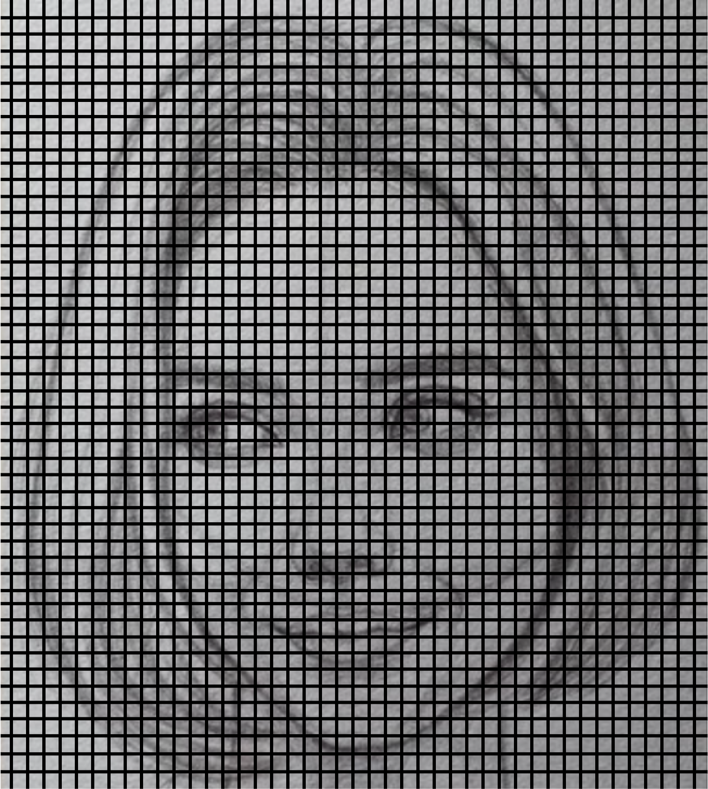

# jshe0589_quiz_8


- **Imaging Technique Inspiration**

My inspiration comes from the mastermind "V.I.K.I." in the movie "I, Robot", which is a Virtual Interactive Kinetic Intelligence. In movies, it usually consists of many cubes, and each small cube with a different pattern forms a large cube with a face. I thought it was a really cool idea, I wanted to make a similar cube that could transform different expressions depending on how often the user used the computer.

.png)
.png)

- **Coding Technique Exploration**

I found the function Orbit Control in the example on p5.js website. 

[Orbit Control](https://p5js.org/examples/3d-orbit-control.html)

_Here is the code for Orbit Control_
```
let cam;
function setup() {
  createCanvas(710, 400, WEBGL);
  cam = createCamera();
  cam.setPosition(0, 0, 0);
}

function draw() {
  background(250);
  let radius = width * 1.5;

  //drag to move the world.
  orbitControl();

  normalMaterial();
  for (let i = 0; i <= 12; i++) {
    for (let j = 0; j <= 12; j++) {
      push();
      let a = (j / 12) * PI;
      let b = (i / 12) * PI;
      translate(
        sin(2 * a) * radius * sin(b),
        (cos(b) * radius) / 2,
        cos(2 * a) * radius * sin(b)
      );
      if (j % 2 === 0) {
        cone(30, 30);
      } else {
        box(30, 30, 30);
      }
      pop();
    }
  }
}

```

According to this code, my idea is to first divide the image of a face into 50*50 squares, then turn these squares into small cubes, and finally form a large cube from these cubes.



Then I'm going to add a counting function, so if keypress more than 10 times in 5 seconds, then the image will be changed to an angry face, and else normal.


